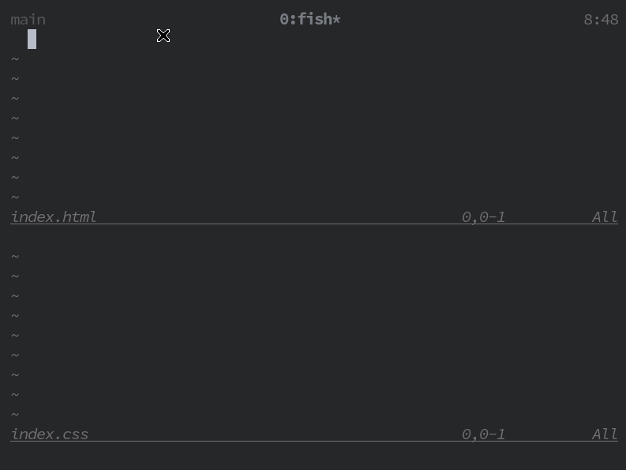

# emmet-ls

Emmet support based on LSP.
Started as [coc-emmet](https://github.com/neoclide/coc-emmet) replacement for [completion-nvim](https://github.com/nvim-lua/completion-nvim). Should work with any lsp client but not tested.

This is a fork of [this](https://github.com/aca/emmet-ls) project which seems
unmaintained.




#### Install
```
npm install -g @kozer/emmet-language-server
```

#### Configuration

- [nvim-lspconfig](https://github.com/neovim/nvim-lspconfig)
  ```lua
  local lspconfig = require'lspconfig'
  local configs = require'lspconfig/configs'

  local capabilities = vim.lsp.protocol.make_client_capabilities()
  capabilities.textDocument.completion.completionItem.snippetSupport = true

  if not lspconfig.emmet_language_server then
    configs.emmet_language_server = {
      default_config = {
        cmd = {'emmet-language-server', '--stdio'};
        filetypes = {
            'html', 'typescriptreact', 'javascriptreact', 'javascript',
            'typescript', 'javascript.jsx', 'typescript.tsx', 'css'
        },
        root_dir = util.root_pattern("package.json", ".git"),
        settings = {};
      };
    }
  end
  lspconfig.emmet_ls.setup{ capabilities = capabilities; }
  ```
- [completion-nvim](https://github.com/nvim-lua/completion-nvim)

  Completion is triggered if completion_trigger_character is entered.
  It's limitation of completion-nvim.

  ```lua
  let g:completion_trigger_character = ['.']
  ```
  If you have set it like this, You will have to add trailing '.' after emmet abbreviation.
  ```
  div>h.
  ```
  And it will be expanded to
  ```
  <div>
    <h class=""></h>
  </div>
  ```
#### Languages

Supports all languages that emmet


